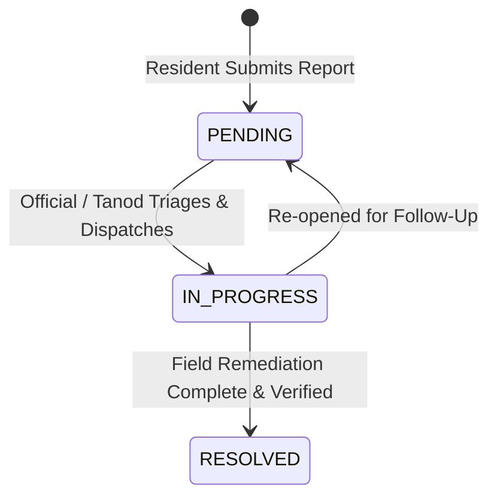

# Issue Reporting & Incident Triage Protocol

This document establishes the four-tier incident triage system, status lifecycle, and role-based permissions governing citizen incident reporting in Gridy.

---

## 1. Four-Tier Urgency Definitions

Every reported issue is classified under one of four standardized urgency tiers:

### Tier 1: `MINOR`
* **Definition:** Non-disruptive, routine neighborhood maintenance or minor disturbances.
* **Examples:** Minor public littering, daytime pet noise, non-blocking sidewalk debris.
* **SLA & Action:** Standard batch review during normal barangay administrative office hours.

### Tier 2: `MODERATE`
* **Definition:** Noticeable community inconvenience or localized infrastructure wear without immediate physical peril.
* **Examples:** Streetlamp outages, potholes on secondary roads, clogged roadside drainage canals, non-functioning public water faucets.
* **SLA & Action:** Inspection and escalation to the barangay infrastructure committee within 24 to 48 hours.

### Tier 3: `HAZARD`
* **Definition:** Physical danger or public safety risk capable of causing property damage or bodily injury if unaddressed.
* **Examples:** Fallen power lines, open uncovered manholes, tree branches blocking primary thoroughfares, minor localized street flooding.
* **SLA & Action:** High-priority notification dispatched immediately to roving Barangay Tanods (`FIELD_OFFICIAL`) for physical cordoning and response within 1 to 4 hours.

### Tier 4: `EMERGENCY`
* **Definition:** Immediate, severe threat to human life, critical infrastructure, or community-wide safety.
* **Examples:** Active structural fires, severe flash floods, violent altercations, armed disturbances, major chemical spills, medical emergencies.
* **SLA & Action:** Real-time priority alert dispatched to all duty officials, with automatic referral to the Philippine National Police (PNP), Bureau of Fire Protection (BFP), or Municipal Disaster Risk Reduction and Management Office (MDRRMO).

---

## 2. Incident Categories

Reports must belong to one of five core domain categories:
* `PEACE_AND_ORDER`: Curfew violations, noise complaints, public intoxication, minor neighborhood disputes.
* `PUBLIC_HEALTH`: Vector-borne sanitation risks, animal bites, hazardous waste, localized outbreaks.
* `INFRASTRUCTURE`: Road damage, broken streetlights, cracked bridges, drainage blockages.
* `ENVIRONMENT`: Illegal dumping in waterways, smoke emissions, deforestation, canal obstructions.
* `OTHER`: Community grievances not categorized above.

---

## 3. Incident Status Lifecycle

* **`PENDING`:** Default initial state assigned upon resident creation. Urgency defaults to `MINOR`.
* **`IN_PROGRESS`:** Assigned when an administrative or field official evaluates the incident, adjusts the urgency level, or dispatches roving personnel.
* **`RESOLVED`:** Incident has been remediated, verified on the ground, and closed with completion notes.

---

## 4. RBAC & Enforcement Rules

1. **Creation Restricted to Residents:**
   * Only verified citizen residents (`IsResident`) can invoke `create` on `IssueReportViewSet`. Officials receive `403 Forbidden` if attempting to file reports through resident endpoints.
2. **Triage Restricted to Officials:**
   * Only Barangay Officials and Field Officials (`IsBarangayOfficialOrField`) can invoke `update` or `partial_update` to transition status or update urgency.
3. **Creation-State Override:**
   * `perform_create()` must force `status = PENDING` and `urgency = MINOR`, setting `reporter = request.user`.
4. **Automated Notification & Non-Repudiation:**
   * When an official updates an incident's status:
     1. An `AuditLog` entry is recorded with previous and new status states.
     2. Asynchronous daemon task `send_notification_to_user_task` triggers a real-time FCM push notification to the reporting resident's device via `@async_task`.