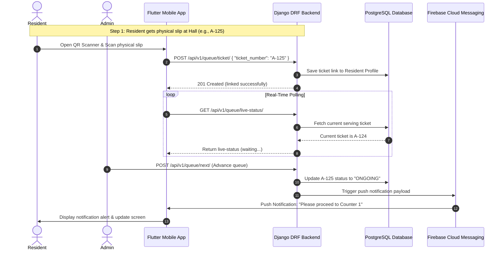
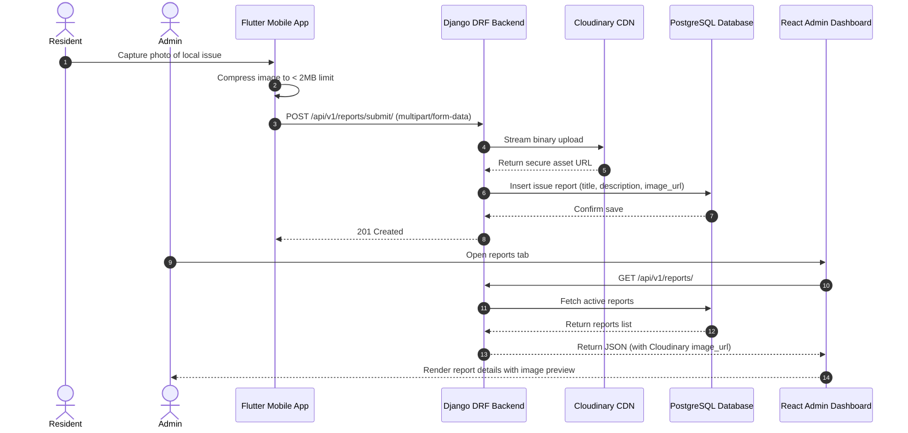

# 08 Core Feature Workflows

## 1. Hybrid Queue Monitoring Workflow
This workflow coordinates physical ticketing at the barangay hall with digital, real-time status updates on the resident's mobile application.

---

## 2. Image-Backed Issue Reporting Workflow
This workflow manages camera capture, local device image compression, streaming to the backend, and hosting media in cloud storage.

